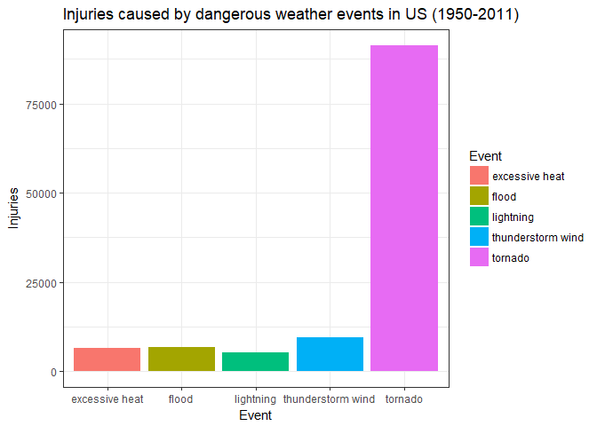
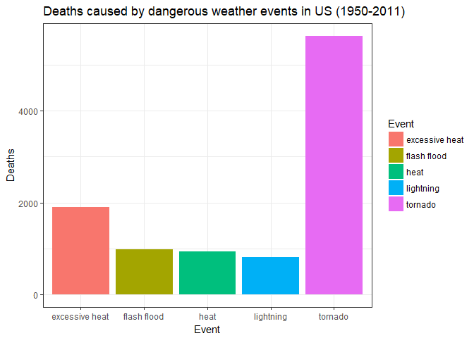
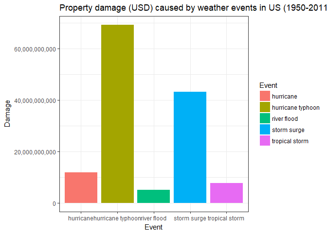
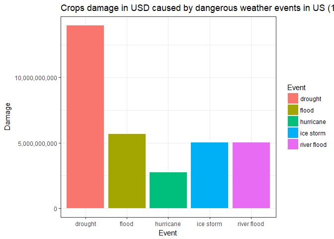

Storms and other severe weather events can cause both public health and economic problems for communities and municipalities. Many severe events can result in fatalities, injuries, and property damage, and preventing such outcomes to the extent possible is a key concern.

In this research we will analyse the 'Storm data' from the National Weather Service with observations from 1950 to November 2011 through US and will try to understand wich events were most harfull for human health and country economy.


## Synopsis
Our brief analysis reveals, that tornados are most dangerous weather natural disaster in US - it causes most human deaths and injuries. Excessive heat takes second place in harming human health.
As for economy - most propery damage is done by hurricanes / typhoons and draught is most harmful for crops.


## Data Processing 
 
At first we'll need to download the 'Storm Data' and read the stormData

```r
if (!file.exists('data.csv.bz2')) {
  download.file('https://d396qusza40orc.cloudfront.net/repdata%2Fdata%2FStormData.csv.bz2', 'data.csv.bz2')
}
stormData <- read.csv('data.csv.bz2')
```

After loading the data we can see a serious mess in 'EVTYPE' column. It has a lot of similar values like 'tstm wnd' and 'THUNDERSTORM WINDS'. A lot of events has paramers in name like 'Wind 60MPH', where wind speed is irrelevant to our analysis. Sometimes names are in lowercase, sometime uppercase, etc.:

```r
head(unique(stormData$EVTYPE), 26)
```

```
##  [1] TORNADO                      TSTM WIND                   
##  [3] HAIL                         FREEZING RAIN               
##  [5] SNOW                         ICE STORM/FLASH FLOOD       
##  [7] SNOW/ICE                     WINTER STORM                
##  [9] HURRICANE OPAL/HIGH WINDS    THUNDERSTORM WINDS          
## [11] RECORD COLD                  HURRICANE ERIN              
## [13] HURRICANE OPAL               HEAVY RAIN                  
## [15] LIGHTNING                    THUNDERSTORM WIND           
## [17] DENSE FOG                    RIP CURRENT                 
## [19] THUNDERSTORM WINS            FLASH FLOOD                 
## [21] FLASH FLOODING               HIGH WINDS                  
## [23] FUNNEL CLOUD                 TORNADO F0                  
## [25] THUNDERSTORM WINDS LIGHTNING THUNDERSTORM WINDS/HAIL     
## 985 Levels:    HIGH SURF ADVISORY  COASTAL FLOOD ... WND
```

Let's bring event types to one form to make our analysis more accurate:

```r
eventTypes <- tolower(stormData$EVTYPE)
## replace punctuation with whitespaces
eventTypes <- gsub('[[:blank:][:punct:]+]', ' ', eventTypes)
eventTypes <- gsub('wnd', 'wind', eventTypes)
eventTypes <- gsub('trees', 'tree', eventTypes)
eventTypes <- gsub('winds', 'wind', eventTypes)
eventTypes <- gsub('tstm', 'thunderstorm', eventTypes)
eventTypes <- gsub('f0', '', eventTypes)
eventTypes <- gsub('mph', '', eventTypes)
eventTypes <- gsub('/ ', ' ', eventTypes)
eventTypes <- gsub('/', ' ', eventTypes)
eventTypes <- gsub('[[:digit:]+]', '', eventTypes)
eventTypes <- gsub('[[:space:]{2,}]', ' ', eventTypes)
eventTypes <- gsub(' g ', '', eventTypes)
eventTypes <- gsub(' - ', '', eventTypes)
stormData$EVTYPE <- eventTypes
```

Still, it's not purfect, but it makes our analysis more precise.

## Impact on human health 
 
Now let's look into events that made most harm to population and caused injusries and deaths.  

#### Top events that caused most injuries
Now we will aggregate (summurize) total injuries quantity by weather event type

```r
injuriesCountByType <- aggregate(stormData$INJURIES, by=list(stormData$EVTYPE), FUN=sum)
injuriesCountByType <- injuriesCountByType[order(-injuriesCountByType$x), ]
injuriesCountByType <- head(injuriesCountByType, 5)
names(injuriesCountByType) <- c('Event', 'Injuries')
injuriesCountByType
```

```
##                 Event Injuries
## 625           tornado    91346
## 587 thunderstorm wind     9353
## 150             flood     6789
## 112    excessive heat     6525
## 369         lightning     5230
```

#### Top events that caused most deaths
And we'll repeat the same for deaths:

```r
deathsCountByType <- aggregate(stormData$FATALITIES, by=list(stormData$EVTYPE), FUN=sum)
deathsCountByType <- deathsCountByType[order(-deathsCountByType$x), ]
deathsCountByType <- head(deathsCountByType, 5)
names(deathsCountByType) <- c('Event', 'Deaths')
deathsCountByType
```

```
##              Event Deaths
## 625        tornado   5633
## 112 excessive heat   1903
## 134    flash flood    978
## 215           heat    937
## 369      lightning    816
```

## Impact on US Economics
Now let's look into events that harmed the US economics: caused damage to property and crops.
In this stormData we have PROPDMG & CROPDMG fields with numbers and also PROPDMGEXP & CROPDMGEXP fields with H/K/M/B letters, meaning hundreds, thouthands, millions and billions. Combining this two fields will get the exact damage in US dollars. 

This function will calculate the new propertyDamage field from DMG and DMGEXP fields:

```r
calculateDamage <- function (amount, type) {
    multiplier <- switch(as.character(type),
        h = 10^2,
        H = 10^2,
        k = 10^3,
        K = 10^3,
        m = 10^6,
        M = 10^6,
        B = 10^9,
        Default = 1
    )
    
    if (as.numeric(amount) > 0) {
        return (as.numeric(amount * multiplier))
    } else {
        return(0)
    }
}
```

#### Top 5 events that caused most property damage
We will calculate damage in absolute numbers in USD and repeat the sum aggregation by event type as we did for human injuries and deaths for property damage

```r
stormData$propertyDamage <- mapply(calculateDamage, stormData$PROPDMG, stormData$PROPDMGEXP)
stormData$propertyDamage <- as.numeric(stormData$propertyDamage)
propertyDamageByEventType <- aggregate(stormData$propertyDamage, by=list(stormData$EVTYPE), FUN=sum)
propertyDamageByEventType <- propertyDamageByEventType[order(-propertyDamageByEventType$x), ]
propertyDamageByEventType <- head(propertyDamageByEventType, 5)
names(propertyDamageByEventType) <- c('Event', 'Damage')
propertyDamageByEventType
```

```
##                 Event      Damage
## 325 hurricane typhoon 69305840000
## 543       storm surge 43323536000
## 316         hurricane 11868319010
## 637    tropical storm  7703890550
## 477       river flood  5118945500
```


#### Top 5 events that caused most crops damage:
And repeat the same for the crops:

```r
stormData$cropsDamage <- mapply(calculateDamage, stormData$CROPDMG, stormData$CROPDMGEXP)
stormData$cropsDamage <- as.numeric(stormData$cropsDamage)
cropsDamageByEventType <- aggregate(stormData$cropsDamage, by=list(stormData$EVTYPE), FUN=sum)
cropsDamageByEventType <- cropsDamageByEventType[order(-cropsDamageByEventType$x), ]
cropsDamageByEventType <- head(cropsDamageByEventType, 5)
names(cropsDamageByEventType) <- c('Event', 'Damage')
cropsDamageByEventType
```

```
##           Event      Damage
## 84      drought 13972566000
## 150       flood  5661968450
## 477 river flood  5029459000
## 341   ice storm  5022113500
## 316   hurricane  2741910000
```


## Results
Let's visualise our data and view the results. 

#### Impact on human health:

```r
library(ggplot2)
ggplot(injuriesCountByType, aes(Event, Injuries, fill = Event)) + 
    geom_bar(stat='identity') + 
    theme_bw() + 
    ggtitle('Injuries caused by dangerous weather events in US (1950-2011)')
```

<!-- -->


```r
ggplot(deathsCountByType, aes(Event, Deaths, fill = Event)) + 
    geom_bar(stat='identity') + 
    theme_bw() + 
    ggtitle('Deaths caused by dangerous weather events in US (1950-2011)')
```

<!-- -->

As it's clearly seen tornado is the most dangerous weather effect, that caused most deaths and injuries.

#### Impact on US economics
Let's build similar plots for damage on crops and property:

```r
ggplot(propertyDamageByEventType, aes(Event, Damage, fill = Event)) + 
    geom_bar(stat='identity') + 
    theme_bw() + 
    scale_y_continuous(label=scales::comma) +
    ggtitle('Property damage (USD) caused by weather events in US (1950-2011)')
```

<!-- -->


```r
ggplot(cropsDamageByEventType, aes(Event, Damage, fill = Event)) + 
    geom_bar(stat='identity') + 
    theme_bw() + 
    scale_y_continuous(label=scales::comma) +
    ggtitle('Crops damage in USD caused by dangerous weather events in US (1950-2011)')
```

<!-- -->

As we can see - the typhoons dealt most damage to property in US - about ~70 billions of dollars in 61 years. 
And it's clearly seen that drought has the most serious impact on crops in United States - about ~14 billion dollars is lost to draught in 61 years.
